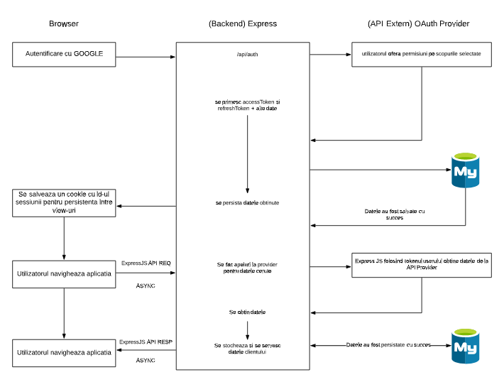

# Arhitectura aplicatiei

Aplicatia este dezvoltata ca un SPA ( Single Page Application ) web, deservita de un server web ( NodeJS ), cu datele persistate intr-o baza de date MariaDB.

Aplicatia web a fost dezvoltata pe partea de frontend cu Angular si cu un backend ExpressJS.

Pentru utilizarea aplicatiei, aceasta a fost integrata cu un API extern ( Google Calendar ), a carui documentatie o puteti gasi aici:

[https://developers.google.com/calendar/api/v3/reference]

Data Flow-ul aplicatiei:

Utilizatorul va face requesturi REST ( GET/POST/PUT/DELTE) in interfata Angular catre API-ul dezvoltat in ExpressJS.

ExpressJS la randul sau va interoga API Provider ( Google Calendar ) si va stoca datele primite in MariaDB dupa care va oferi datele clientului, totul in mod asincron folosind promise-uri.

Angular va astepta primirea datelor de la ExpressJS si folosind libraria RxJS Observables, actualizeaza asincron interfata utilizatorului, in aceeasi pagina, cu datele primite de la ExpressJS.
